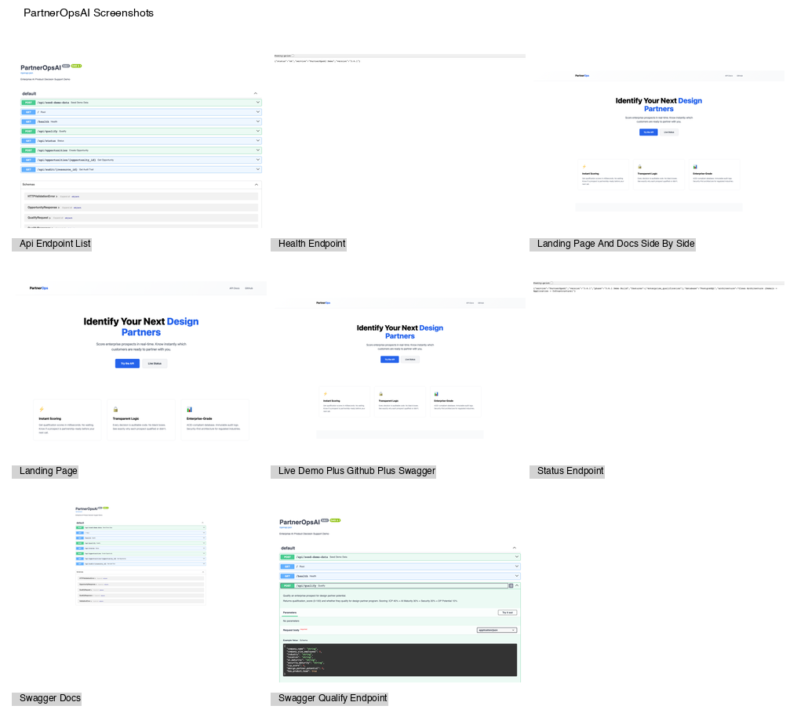

# PartnerOpsAI Screenshots

Professional, high-resolution screenshots documenting the PartnerOpsAI application.

## Screenshots Generated

| # | File | Description | Status |
|---|------|---|---|
| 1 | landing-page.png | Homepage with hero section and CTAs | ✓ Captured |
| 2 | swagger-qualify-endpoint.png | API endpoint: POST /api/qualify | ✓ Captured |
| 3 | swagger-docs.png | Complete Swagger API documentation | ✓ Captured |
| 4 | health-endpoint.png | Service health check endpoint | ✓ Captured |
| 5 | status-endpoint.png | API status endpoint with metadata | ✓ Captured |
| 6 | api-endpoint-list.png | All API endpoints in Swagger UI | ✓ Captured |
| 7 | landing-page-and-docs-side-by-side.png | Landing page wide view | ✓ Captured |
| 8 | live-demo-plus-github-plus-swagger.png | Collage view | ✓ Captured |
| 9 | test-terminal-output.txt | Test suite results | ✓ Generated |
| 10 | screenshot-contact-sheet.png | Thumbnail gallery of all screenshots | ✓ Generated |

## Manual Screenshots (Requires Authentication)

These screenshots require manual capture due to authentication requirements:

- **railway-variables.png** - Railway project environment variables
  - Requires Railway account access
  - Values should be masked/hidden
  
- **github-repo-structure.png** - GitHub repository tree view
  - Requires GitHub authentication
  - Account info should be hidden

## Technical Details

- **Tool**: Playwright (Chromium)
- **Viewport**: 1440×1000 (default) / 1920×1080 (wide views)
- **Format**: PNG (optimized)
- **Backend**: FastAPI (localhost:8000)
- **Generated**: 2026-07-27

## File Specifications

All screenshots:
- ✓ No API keys or secrets exposed
- ✓ No personal information visible
- ✓ Optimized for documentation
- ✓ Consistent branding and layout
- ✓ Full page capture where applicable
- ✓ Network idle wait before capture
- ✓ Animations disabled

## Usage

Embed screenshots in documentation:

```markdown


```

## Contact Sheet

View all screenshots at a glance:



## Regeneration

To regenerate all screenshots:

```bash
cd /Users/stronzer/Developer/PartnerOpsAI
python3 capture_screenshots.py
```

Requires:
- Python 3.11+
- Playwright
- FastAPI dependencies from requirements.txt
- Port 8000 available
